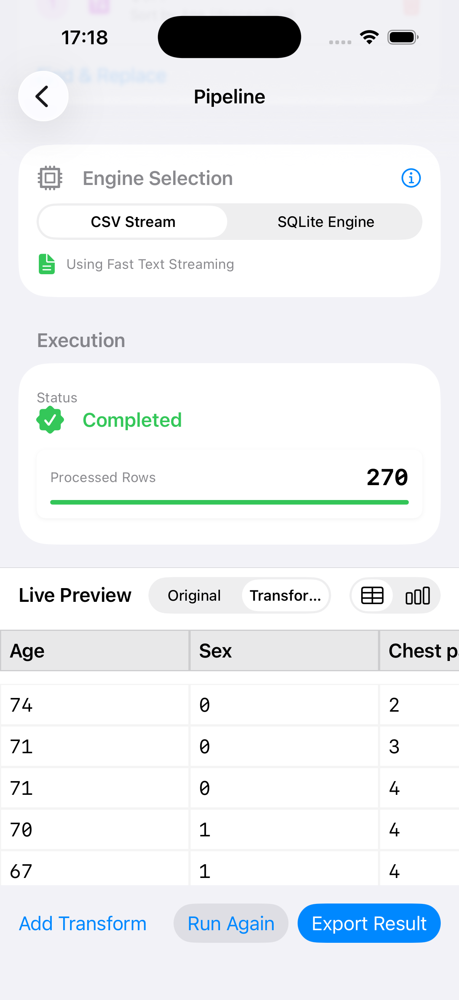
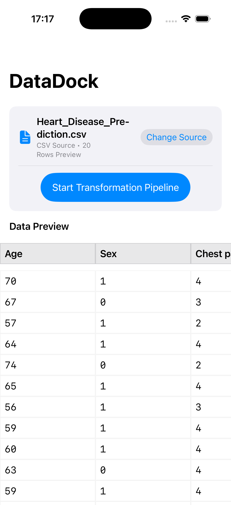
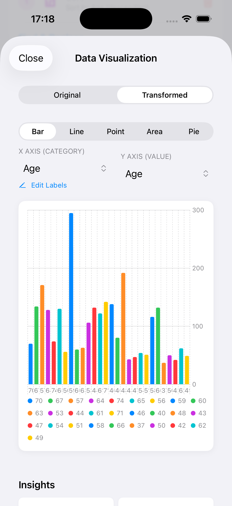
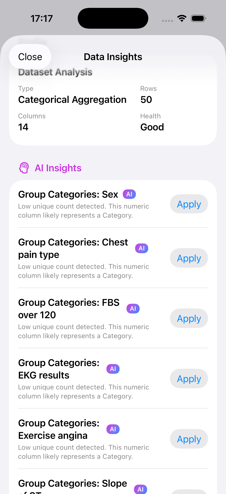
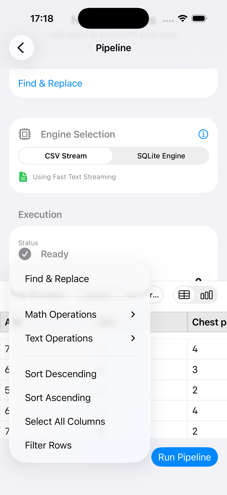
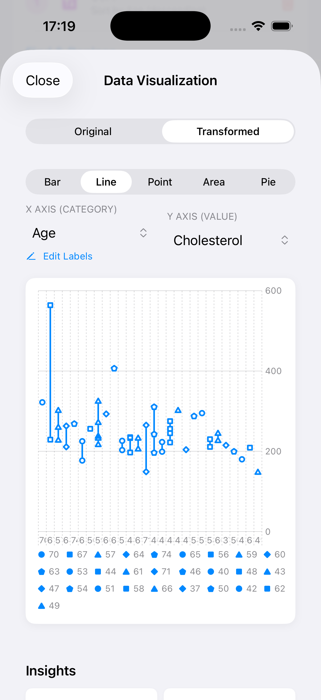

# DataForge (DataDock)

DataForge is a high-performance, offline-first ETL (Extract, Transform, Load) engine built for iOS. It allows users to ingest large datasets, define transformation pipelines, and export results entirely on-device, respecting memory constraints and battery life.

## Architecture

The application follows a modular architecture separating the Core ETL Engine from the UI Features.

### Core Components

- **Extract Layer (`CSVExtractor`)**:
  - Implements `DataSource` protocol.
  - Uses Swift's `AsyncSequence` (URL.lines) for streaming read.
  - Supports schema inference and chunked processing to handle files larger than available RAM.
  - Never loads the entire file into memory.

- **Transform Layer (`TransformOperation`)**:
  - Protocol-based transformation logic.
  - `FilterTransform`: Row-level filtering based on dynamic conditions.
  - `SelectTransform`: Column projection.
  - `RenameTransform`: Schema modification.
  - Transformations are applied sequentially on each `DataChunk`.

- **Load Layer (`Loader`)**:
  - `CSVLoader` writes processed chunks to disk immediately.
  - Uses `FileHandle` for efficient appending.

- **Pipeline Engine (`PipelineEngine`)**:
  - Orchestrates the ETL process using Swift Concurrency (`Task`, `async/await`).
  - Manages state (Idle, Running, Cancelled, Failed).
  - Handles backpressure via stream processing.

### UI Architecture (MVVM)

- **Import**: File picker and live preview of raw data.
- **Pipeline Editor**: Visual interface to construct transformation chains.
- **Visualization**: `DataTableView` for efficient rendering of tabular data.

## Key Features

- **Zero Backend**: All processing is local.
- **Streaming First**: Designed for large CSVs (up to 200MB+).
- **Memory Safe**: Processes data in configurable chunks (default: 1000 rows).
- **Extensible**: New transforms can be added by conforming to `TransformOperation`.

## Tech Stack

- **Language**: Swift 6
- **UI**: SwiftUI
- **Concurrency**: async/await, TaskGroup, Actors
- **Storage**: FileManager (Flat files)

## Project Structure

```
DataDock/
├── Core/
│   ├── Engine/         # Pipeline, DataSource, Loader protocols
│   ├── Models/         # Schema, Row, DataValue types
│   └── Utils/          # Helpers
├── Features/
│   ├── Import/         # File ingestion UI
│   ├── Transform/      # Pipeline editor UI
│   └── Visualize/      # Data preview components
├── Services/
│   └── FileIO/         # CSV Parser and Writer
└── Resources/          # Sample data
```

## Screenshots

| Pipeline Editor | Data Visualization |
|:---:|:---:|
|  |  |
| **Engine Selection** | **Chart Types** |
|  |  |
| **AI Insights** | **Data Profile** |
|  |  |

## Getting Started

1. Open `DataDock.xcodeproj` in Xcode 15+.
2. Run on Simulator or Device.
3. Tap "Select CSV File" and choose `sample_data.csv` from the Resources folder (you may need to move it to Files app on Simulator).
4. Add transformations (e.g., Filter where `age > 30`).
5. Run Export to save the transformed file.

## Testing Strategy

- **Unit Tests**:
  - Test `CSVExtractor` with various delimiters and edge cases.
  - Test `FilterTransform` logic independently.
- **Integration Tests**:
  - Run full pipeline with known input and verify output checksum.
- **Performance Tests**:
  - Measure memory usage during processing of 100MB file using Instruments.

## Known Limitations & Future Work

- **CSV Parsing**: Currently splits by comma. Needs robust handling of quoted newlines.
- **Sorting**: Sort transform is not yet implemented (requires external sort for large datasets).
- **Charts**: Visualization currently limited to Table View.

## License

Proprietary.
